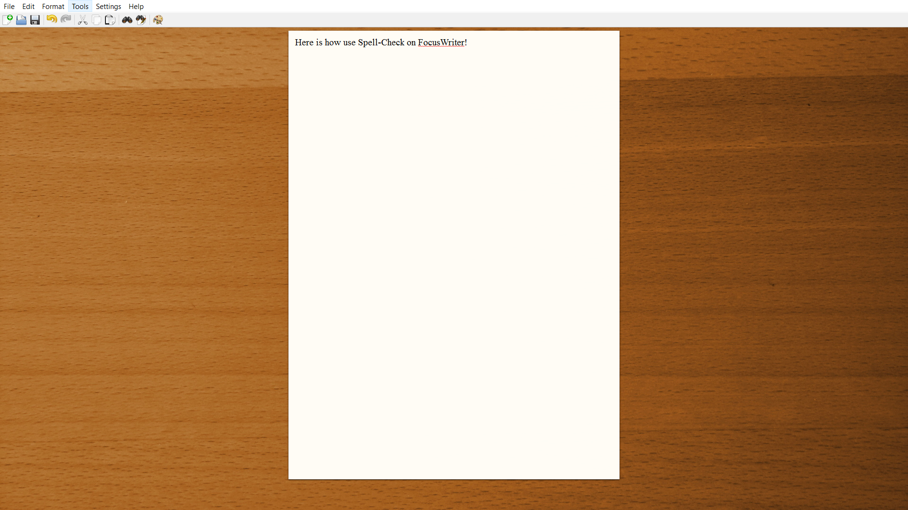
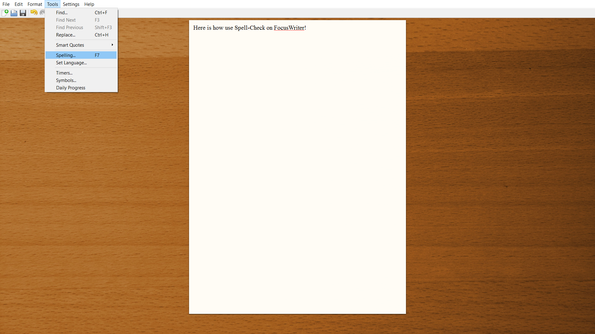
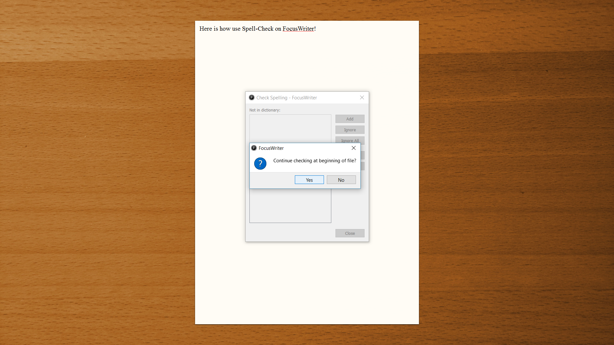
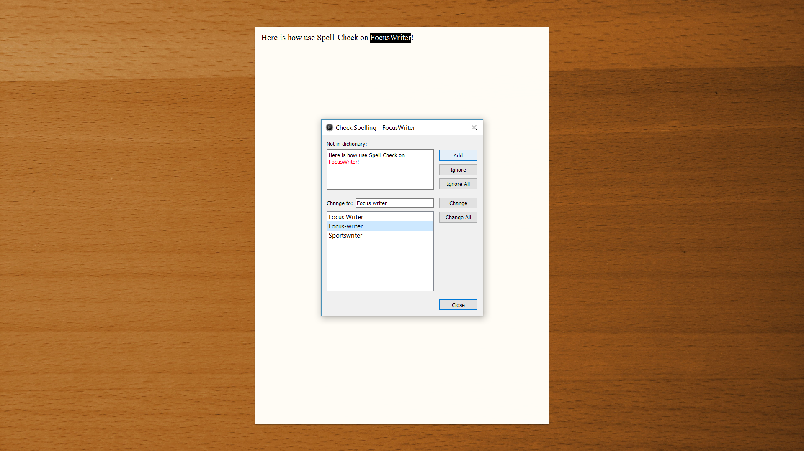
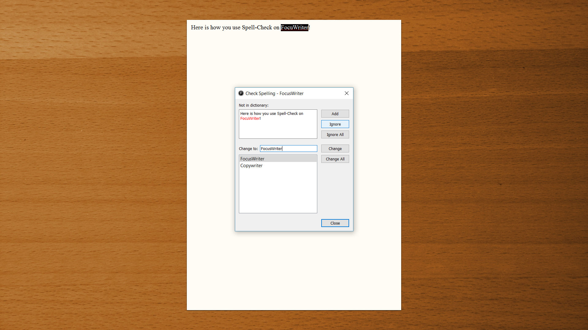
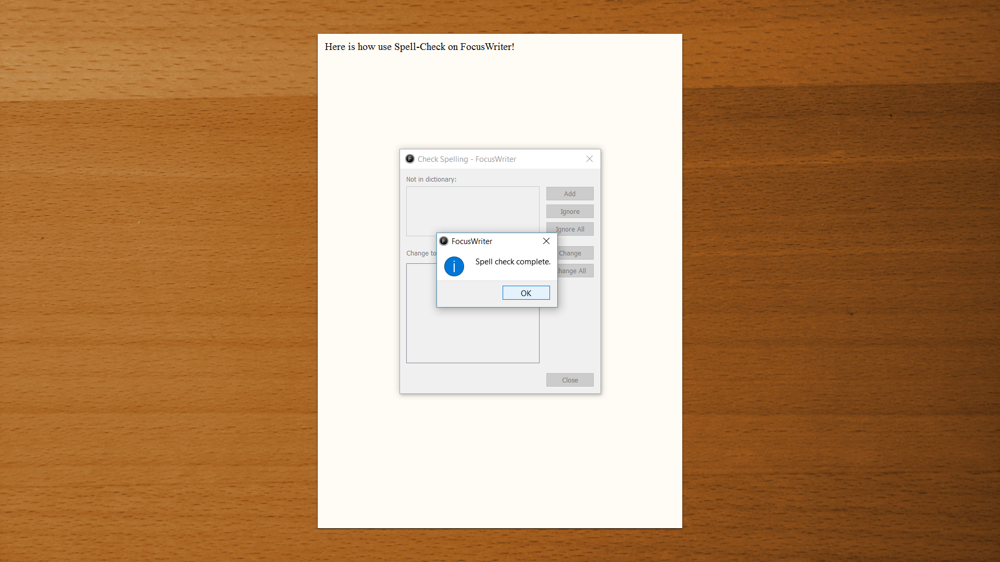

# How to use FocusWriter's Spell-Check

**Step 1-** 
Move your cursor to the top left hand corner of your computer screen and the home bar will appear. Click on the "Tools" option. 

**Step 2-**
The tools options will drop down and there will be a list of tools to choose from. Click on the "Spelling..." option.

**Step 3-**
FocusWriter will ask the user if they want to "Continue checking at the beginning of the file", Click "Yes".

**Step 4-**
Focus writer will go through each spelling mistake and offer a list of alternative spelling suggestions. If you would like to change the error to a suggested word, click on the suggestion and click "Add."

**Step 5-**
If you wish to ignore the error FocusWriter has detected, simply click ignore 

**Step 6-**
Once the user has successfuly completed the spell check, a pop up will appear stating, "Spell check complete". 

