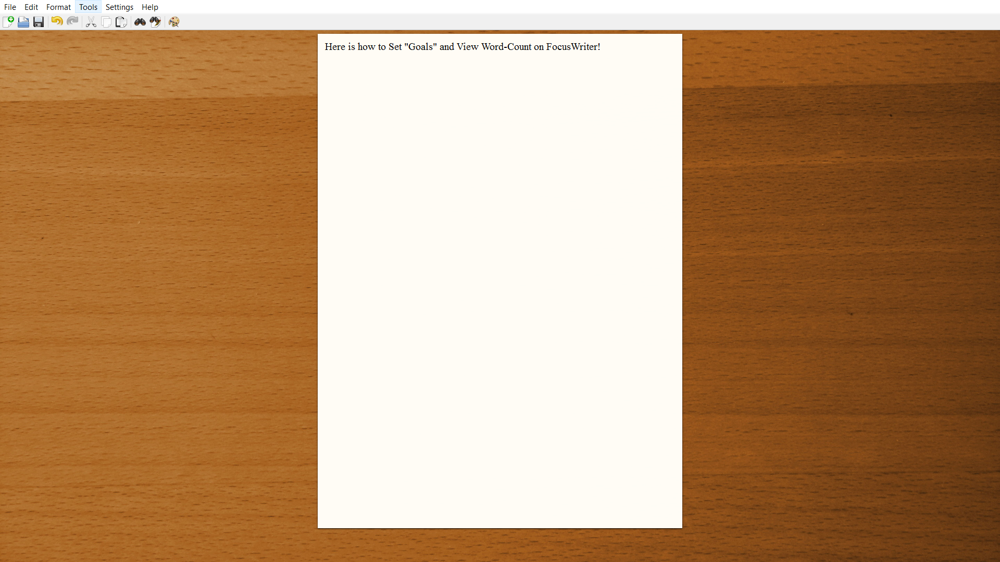
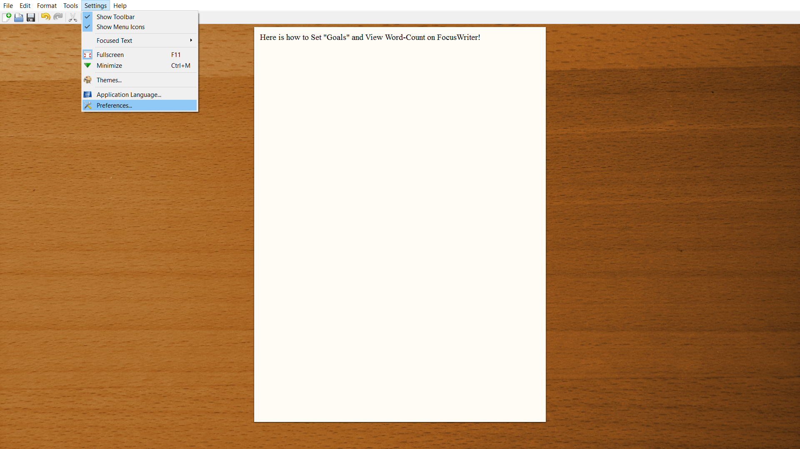
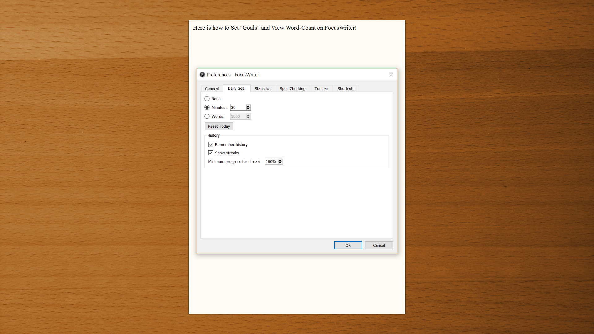
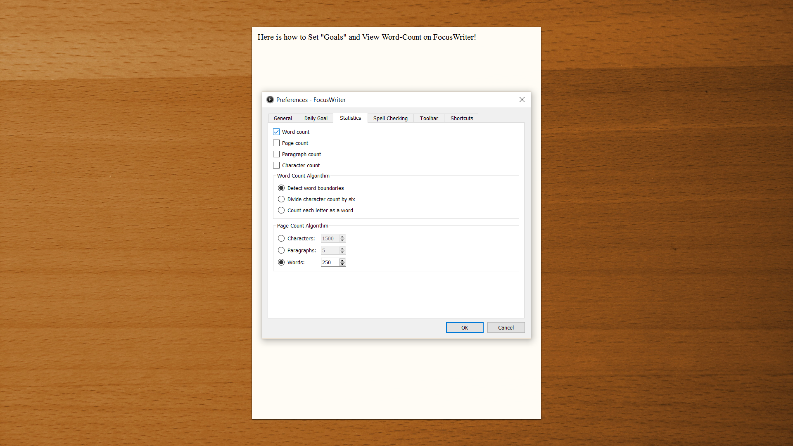
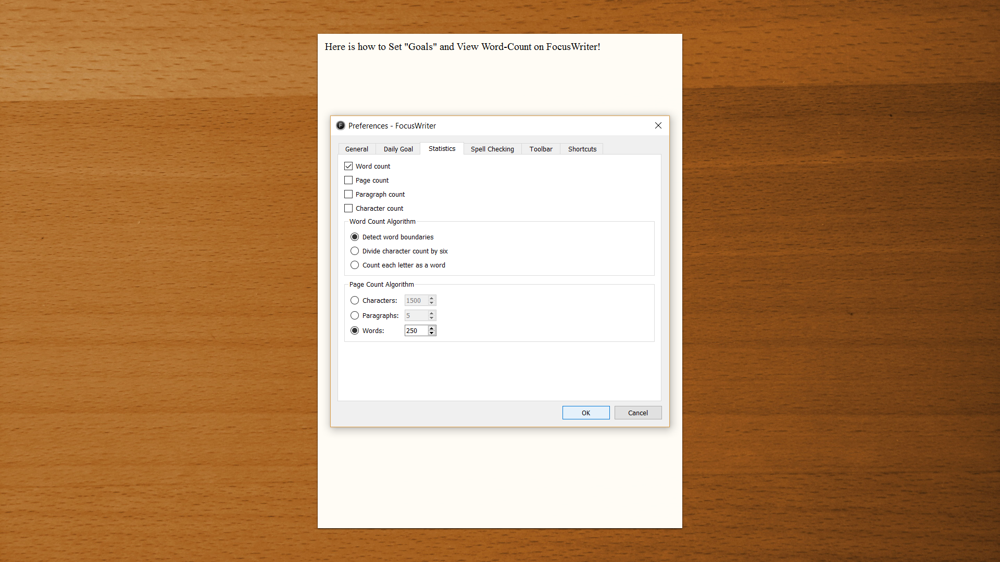
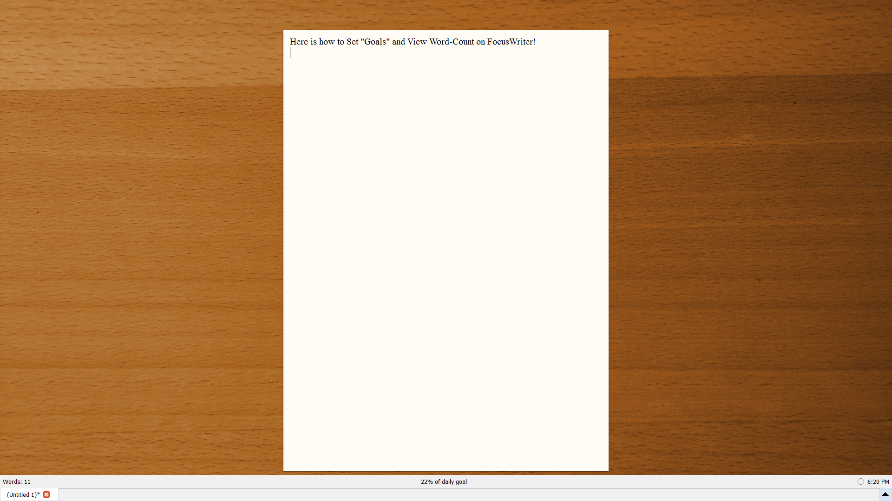

## How to Set "Goals" and View Word-Count 
**Step 1-**
Move your cursor to the top left hand corner of your computer screen and the home bar will appear. Click on the "Tools" option.

**Step 2-**
The tools options will drop down and there will be a list of tools to choose from. Click on the "Preferences..." option. 

**Step 3- Setting Goals**
The Preferences options will pop-up and selcting the "Daily Goal" option will allow you to alter the amount of time (in minutes), or number of words you want to dedicate to working on the file in one sitting. 

**Step 4- Viewing your Word Count**
Selecting to "Statistics" file will allow you to view your word count by checking the box labled "Word Count" 

**Step 5- Saving the Changes**
After making all the preference changes the user considers necessary, selecting "OK" at the bottom the preferences pop-up will save your changes.

**Step 6- Seeing your Word Count**
Users can view their file's word count by moving their cursor over the very bottom of their FocusWriter file. The word count will appear in the bottom left hand corner. 

