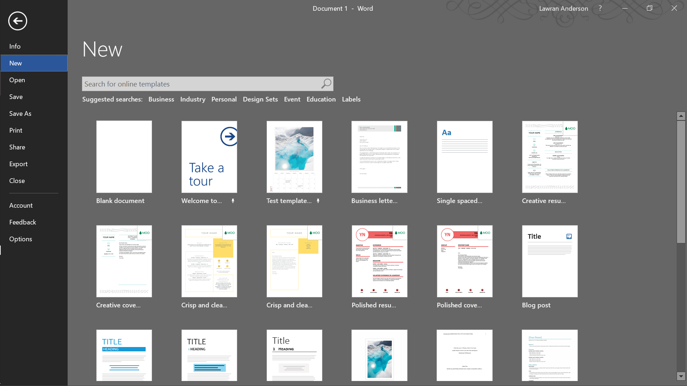
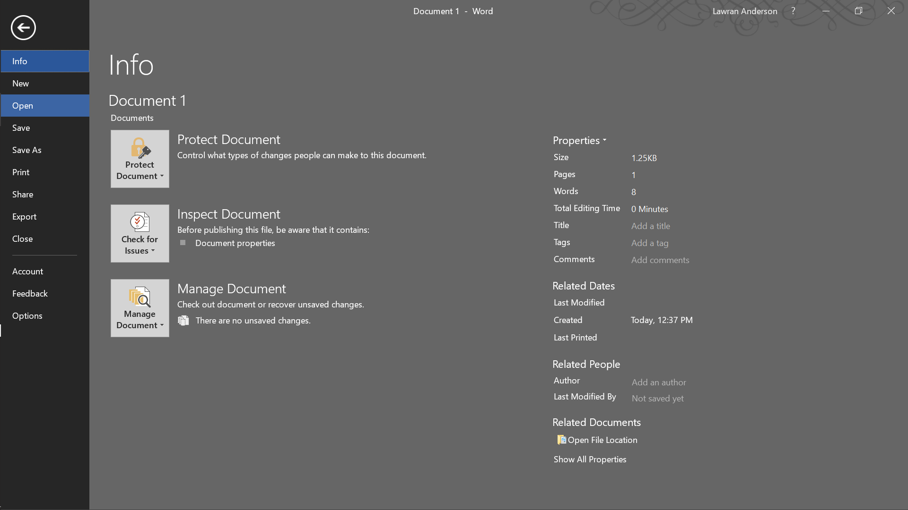
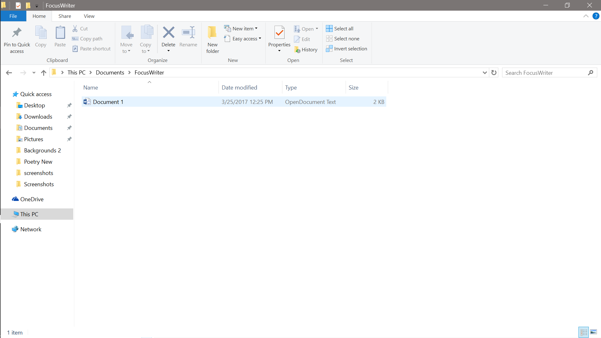
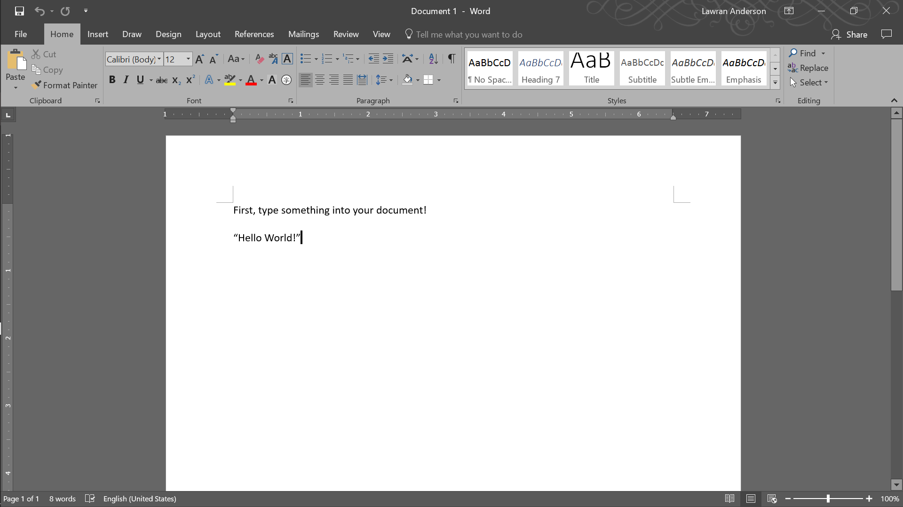

# How to Export FocusWriter Documents
**Step 1** - Using your FocusWriter documents in other word-processors, such as Microsoft Word (used in the example below) is very simple! First, open up your new word processor.

**Step 2** - Click where you normally would to open a pre-existing document on your computer. In microsoft word, you simply go to the "open" tab.

**Step 3** - Find the FocusWriter document you would like to open. The example file used in this instruction is the "Document 1" created in Section 9. Note how the file type shows "OpenDocument Text". This is a quick way of telling whether or not your document was created in FocusWriter. Select the document, and click "OK" or "Accept" when prompted by your new word processor.

**Step 4** - Your FocusWriter document should open seamlessly on any new wordprocessor you choose (even the basic "Wordpad" offered on Windows!). Feel free to edit and change the document as you wish! Most users find that FocusWriter documents are best written in FocusWriter, but shaped in a separate word processor.

