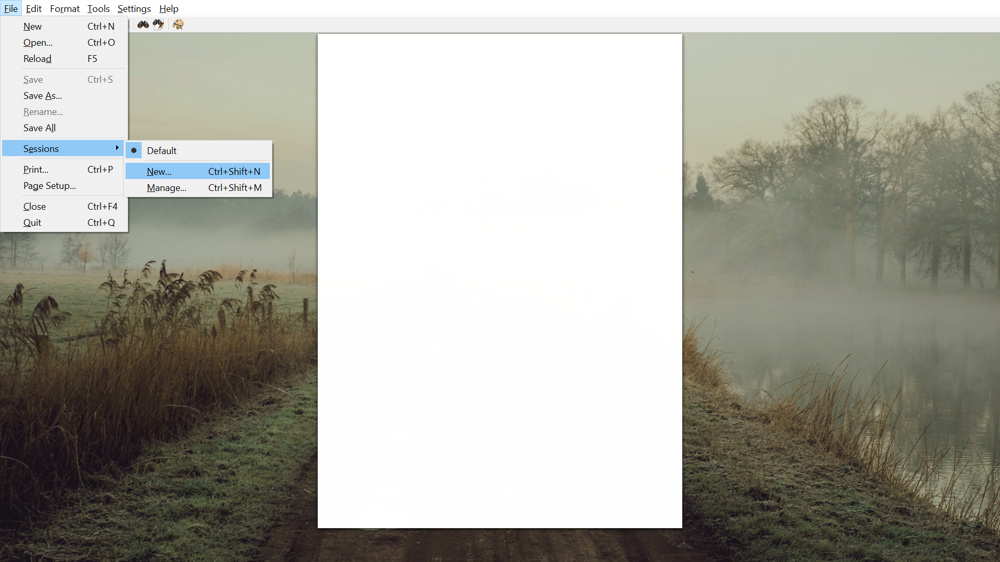

# How to Manage Files and Sessions in FocusWriter
**Step 1** - Mouse over the "file" section at the top left-hand corner of the screen, and mouse over the "sessions" tab near the bottom.

**Step 2** - Click on the "New" section that was opened up after mousing over "sessions". This will allow you to create a new session.

**Step 3** - After clicking "New", a window will pop-up prompting you to title your new session. Here, it will be titled "Session 1". Click "OK" to confirm your title, and to close the window.

**Step 4** - After the pop-up closes, you are free to type in your new session!

**Step 5** - Now, let's make a new session. Once again, mouse over the "file" section at the top left-hand corner of the screen, and mouse over the "sessions" tab near the bottom. Note that our first session "Session 1" is visible in the dropdown list.

**Step 6** - To create another session, click on the "manage" section within the dropdown list.

**Step 7** - After clicking "manage", a window will pop up which allows you to manage your sessions. To create another session, click the button labeled "new". A pop-up will open prompting you to title your session. Title your new session, "Session 2". 

**Step 8** - Click "OK" after titling your new session to close the pop-up window. Now, you should see two sessions in the manager.

**Step 9** - Here, you will learn how to switch between sessions. First, try typing something into Session 1, as shown in the example picture below.

**Step 10** - Now, mouse over the "file" section at the top left-hand corner of the screen, and mouse over the "sessions" tab near the bottom. Note that "Session 1" and "Session 2" are now both visible in the dropdown list. "Session 1" has a bullet-mark beside it, indicating that it is the currently open session. Now, click on "Session 2".

**Step 11** - IF after clicking on "Session 2" you receive a pop-up prompting you to save the file, click "Save" to save your session.

**Step 12** - After clicking "Session 2", FocusWriter will switch to the document that was being typed in "Session 2". Congratulations! You have successfully created two sessions, and learned how to quickly and efficiently swap between them!

